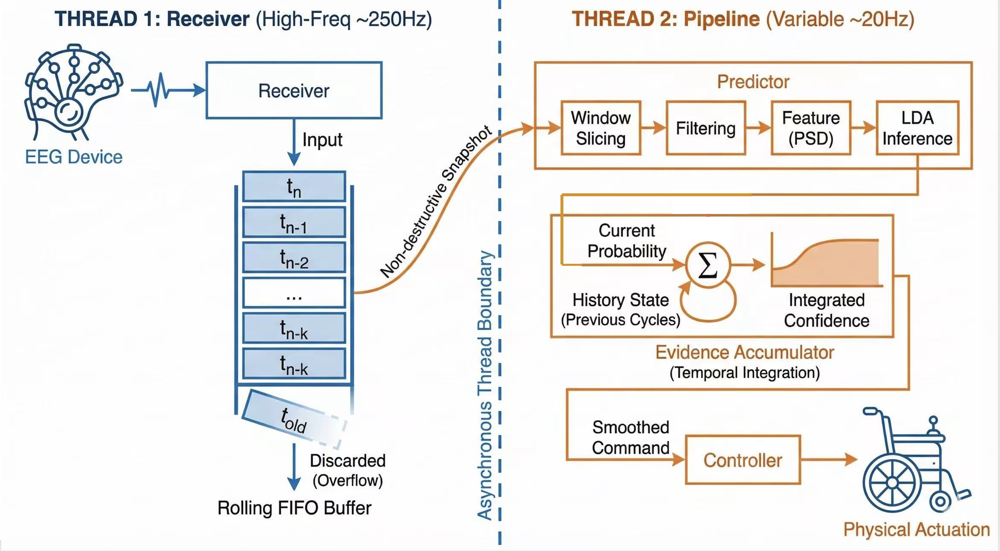
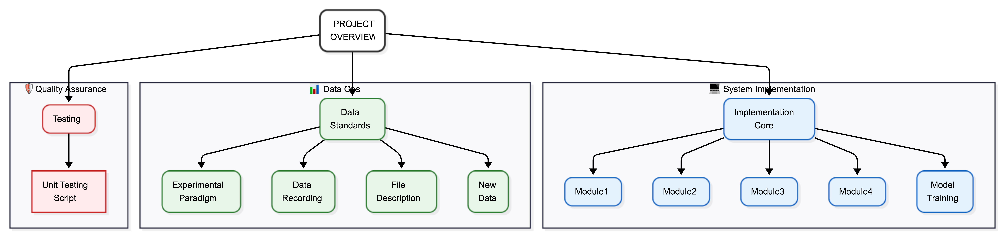

### Real-time Control Challenges & Solutions



you can run the following cmd to test the system:
```bash
python==3.10

pip install -r requirements.txt

python main_test.py
```


**1. Sampling Rate Mismatch**
- **Problem:** The EEG hardware streams data (250Hz) faster than the inference or motor control loops can process, leading to potential lag or backlog.
- **Solution:** **Rolling FIFO Buffer**. We utilize a rolling FIFO buffer to maintain the most current EEG signals. The predictor asynchronously retrieves the latest data chunk from this buffer to forecast MI signals and control the wheelchair. The operating frequency depends on the pipeline's processing speed, ensuring minimal latency.

**2. Signal Instability**
- **Problem:** Raw EEG predictions fluctuate due to noise, causing erratic wheelchair movements (jitter) or false positives.
- **Solution:** **Evidence Accumulation**. We implement a continuous integrator (Leaky Integrate-and-Fire). Movement commands are only triggered when the accumulated confidence score exceeds a robust threshold, effectively smoothing out transient noise.
- **Notes**: Turning requires strong and continuous mental concentration

## Modules

This project consists of four main modules that work together to translate EEG signals into wheelchair control commands.

### 1. EEG Receiver (`modules/eeg_receiver.py`)
- **Content**: Handles the connection to the EEG hardware (Explore device) or simulates a stream from a file. It runs a background thread to continuously acquire data and maintain a thread-safe rolling FIFO buffer (deque).
- **Input**: 
  - **Source**: EEG Device stream (Bluetooth) or `.npy`/`.csv` file.
  - **Format**: Raw packets usually containing timestamp and multi-channel EEG data (e.g., 250Hz sampling rate).
- **Output**: 
  - **Format**: `numpy.ndarray` (via `get_buffer_data()`).
  - **Shape**: `(N, 1 + n_channels)`, where `N` is the number of samples in the buffer, and the first column is the timestamp.
  - **Content**: Raw time-series EEG data.

### 2. MI Predictor (`modules/mi_predictor.py`)
- **Content**: Processes the raw EEG data to predict Motor Imagery (MI) intent. It performs preprocessing (bandpass filtering), feature extraction (PSD), and inference classifiers.
- **Input**: 
  - **Format**: `numpy.ndarray` (from Receiver buffer).
  - **Shape**: `(N, 1 + n_channels)`.
  - **Content**: Segmented EEG data matching the required window size (e.g., 1.0s).
- **Output**: 
  - **Content**: Raw classification result (e.g., `0` for Left, `1` for Right, or `None` if buffer insufficient/uncertain).

### 3. Evidence Accumulator (`modules/evidence_accumulator.py`)
- **Content**: Implements a temporal smoothing algorithm (e.g., Leaky Integrate-and-Fire) to stabilize likely noisy predictions from the MI Predictor. It accumulates evidence over consecutive frames before triggering a command.
- **Input**: 
  - **Content**: Raw prediction sequence from the MI Predictor over time.
- **Output**: 
  - **Content**: Stable high-level command (`'left'`, `'right'`, `'stop'`).
  - **Format**: String.

### 4. Wheelchair Controller (`modules/wheelchair_controller.py`)
- **Content**: Interfaces with the physical wheelchair hardware or simulation environment to execute movement commands.
- **Input**: 
  - **Content**: Stable command strings (`'left'`, `'right'`, `'stop'`).
- **Output**: 
  - **Content**: Hardware signals (e.g., motor speed/direction values).

### Future Plan
**1. Process Logging & Visualization**

- **Pipeline Monitoring**: High-level visual tracking of the entire process to provide clear insights into system operations.

- **Signal-Prediction Alignment**: Synchronized visualization of EEG signals(including the receiver buffer) alongside model predictions for precise behavioral analysis.

- **Comparative Analysis**: When using ground-truth labeled data, the system provides a side-by-side visualization of labels vs. model predictions, facilitating intuitive performance assessment during testing.


**2. Improving prediction accuracy**
- integrated real-time artifact correction into current prediction proccess. [post](https://www.linkedin.com/posts/victor-ferat_python-eeg-meg-activity-7415019925267853312-YJF8/?utm_source=share&utm_medium=member_android&rcm=ACoAABYU9BsBVhMTffCvRJALhNsmM7-QLtESekQ), [paper](https://www.biorxiv.org/content/10.1101/2025.10.04.680449v1)

## Mindmap




## Modules(detail)

### MI Predictor (`mi_predictor.py`)

The `MI_Predictor` class is responsible for real-time Motor Imagery (MI) classification from continuous EEG data streams using a pre-trained machine learning model (LDA).

#### Input
*   **Data Type**: `numpy.ndarray`
*   **Shape**: `(n_samples, n_channels + 1)` or `(n_samples, n_channels)`
    *   The module automatically detects if a timestamp column (index 0) is present (common in `EEG_Receiver` output) and removes it before processing.
    *   Default channel configuration expects 4 channels (e.g., Fcz, C3, Cz, C4).

#### Output
*   Returns a string indicating the predicted command:
    *   `'left'`: Left-hand motor imagery detected.
    *   `'right'`: Right-hand motor imagery detected.
    *   `'none'`: Returned when no valid prediction can be made (e.g., insufficient data, model error, or unmapped class).

#### Processing Pipeline
1.  **Data Validation & Management**:
    *   **Insufficient Data**: If the input buffer length is shorter than the required window size (default 5 seconds), the module prints a warning (`Insufficient data...`) and returns `'none'` to avoid errors.
    *   **Window Slicing**: If the input buffer contains more data than the window size, it automatically slices the **most recent** segment (e.g., last 1250 samples for 5s @ 250Hz) for analysis.

2.  **Signal Preprocessing**:
    *   **Cz Re-referencing**: (Optional) If the 'Cz' channel is defined, data is re-referenced to Cz, and the Cz channel is removed.
    *   **Notch Filtering**: Applies a 4th-order Butterworth band-stop filter (45-55 Hz) to remove power-line noise.
    *   **Band-pass Filtering**: Applies a 4th-order Butterworth band-pass filter (default 7-30 Hz) to isolate mu/beta rhythms relevant to MI.

3.  **Feature Extraction**:
    *   Computes **Power Spectral Density (PSD)** features using Welch's method.
    *   Configuration matches legacy matplotlib parameters: 1-second Hanning window, no overlap.

4.  **Inference**:
    *   Uses a pre-loaded `sklearn.discriminant_analysis.LinearDiscriminantAnalysis` (LDA) model to classify the extracted PSD features.


### Evidence Accumulator (`evidence_accumulator.py`)

The `Evidence_Accumulator` class implements a temporal smoothing algorithm (Leaky Integrate-and-Fire inspired) to stabilize noisy predictions coming from the MI Predictor. It accumulates evidence over consecutive frames before triggering a stable high-level command, preventing jittery control outputs.

#### Input
*   **Data Type**: `str`
*   **Format**: A raw prediction sequence from `MI_Predictor` (e.g., `'left'`, `'right'`, `'none'`) called frame-by-frame.

#### Output
*   Returns a stabilized command string:
    *   `'left'`, `'right'`, or `'stop'`.

#### Algorithm & Logic
1.  **Frame-Based Update**:
    *   The accumulator operates in discrete time steps (frames), typically synchronized with the application's main control loop frequency (e.g., 20Hz [0.05 seconds]).
    *   At each update, all existing evidence scores **decay** by a fixed amount (`decay`).

2.  **Evidence Building**:
    *   If the incoming raw prediction matches a valid class ('left' or 'right'), its specific evidence score increases by `build_rate`.
    *   Values are clamped between 0 and `max_evidence`.

3.  **Command Triggering with Hysteresis**:
    *   **Activation**: A command (e.g., 'left') is triggered only when its accumulated evidence exceeds the `threshold`.
    *   **Maintenance (Hysteresis)**: Once a command is active, the threshold required to maintain it drops (multiplied by `hysteresis_factor`). This prevents the command from toggling off due to brief signal drops or noise.
    *   If evidence drops below the maintenance threshold, the output reverts to `'stop'`.
