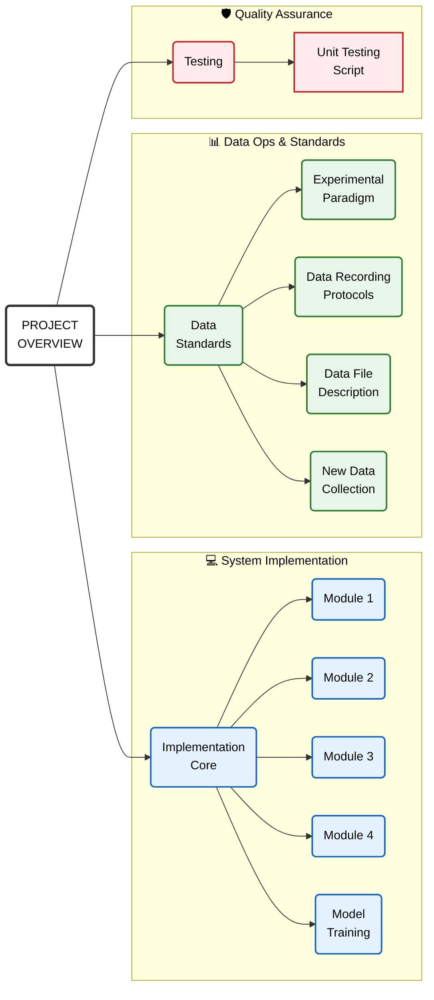

### Real-time Control Challenges & Solutions

**1. Sampling Rate Mismatch**
- **Problem:** The EEG hardware streams data (250Hz) faster than the inference or motor control loops can process, leading to potential lag or backlog.
- **Solution:** **Rolling FIFO Buffer**. We utilize a rolling FIFO buffer to maintain the most current EEG signals. The predictor asynchronously retrieves the latest data chunk from this buffer to forecast MI signals and control the wheelchair. The operating frequency depends on the pipeline's processing speed, ensuring minimal latency.

**2. Signal Instability**
- **Problem:** Raw EEG predictions fluctuate due to noise, causing erratic wheelchair movements (jitter) or false positives.
- **Solution:** **Evidence Accumulation**. We implement a continuous integrator (Leaky Integrate-and-Fire). Movement commands are only triggered when the accumulated confidence score exceeds a robust threshold, effectively smoothing out transient noise.
- **Notes**: Turning requires strong and continuous mental concentration

## Modules

This project consists of four main modules that work together to translate EEG signals into wheelchair control commands.

### 1. EEG Receiver (`modules/eeg_receiver.py`)
- **Content**: Handles the connection to the EEG hardware (Explore device) or simulates a stream from a file. It runs a background thread to continuously acquire data and maintain a thread-safe rolling FIFO buffer (deque).
- **Input**: 
  - **Source**: EEG Device stream (Bluetooth) or `.npy`/`.csv` file.
  - **Format**: Raw packets usually containing timestamp and multi-channel EEG data (e.g., 250Hz sampling rate).
- **Output**: 
  - **Format**: `numpy.ndarray` (via `get_buffer_data()`).
  - **Shape**: `(N, 1 + n_channels)`, where `N` is the number of samples in the buffer, and the first column is the timestamp.
  - **Content**: Raw time-series EEG data.

### 2. MI Predictor (`modules/mi_predictor.py`)
- **Content**: Processes the raw EEG data to predict Motor Imagery (MI) intent. It performs preprocessing (bandpass filtering), feature extraction (PSD), and inference classifiers.
- **Input**: 
  - **Format**: `numpy.ndarray` (from Receiver buffer).
  - **Shape**: `(N, 1 + n_channels)`.
  - **Content**: Segmented EEG data matching the required window size (e.g., 1.0s).
- **Output**: 
  - **Content**: Raw classification result (e.g., `0` for Left, `1` for Right, or `None` if buffer insufficient/uncertain).

### 3. Evidence Accumulator (`modules/evidence_accumulator.py`)
- **Content**: Implements a temporal smoothing algorithm (e.g., Leaky Integrate-and-Fire) to stabilize likely noisy predictions from the MI Predictor. It accumulates evidence over consecutive frames before triggering a command.
- **Input**: 
  - **Content**: Raw prediction sequence from the MI Predictor over time.
- **Output**: 
  - **Content**: Stable high-level command (`'left'`, `'right'`, `'stop'`).
  - **Format**: String.

### 4. Wheelchair Controller (`modules/wheelchair_controller.py`)
- **Content**: Interfaces with the physical wheelchair hardware or simulation environment to execute movement commands.
- **Input**: 
  - **Content**: Stable command strings (`'left'`, `'right'`, `'stop'`).
- **Output**: 
  - **Content**: Hardware signals (e.g., motor speed/direction values).

### Future Plan
**1. Process Logging & Visualization**

- **Pipeline Monitoring**: High-level visual tracking of the entire process to provide clear insights into system operations.

- **Signal-Prediction Alignment**: Synchronized visualization of EEG signals(including the receiver buffer) alongside model predictions for precise behavioral analysis.

- **Comparative Analysis**: When using ground-truth labeled data, the system provides a side-by-side visualization of labels vs. model predictions, facilitating intuitive performance assessment during testing.

**2. Improving prediction accuracy**
- integrated real-time artifact correction into current prediction proccess. [post](https://www.linkedin.com/posts/victor-ferat_python-eeg-meg-activity-7415019925267853312-YJF8/?utm_source=share&utm_medium=member_android&rcm=ACoAABYU9BsBVhMTffCvRJALhNsmM7-QLtESekQ), [paper](https://www.biorxiv.org/content/10.1101/2025.10.04.680449v1)

## Mindmap

